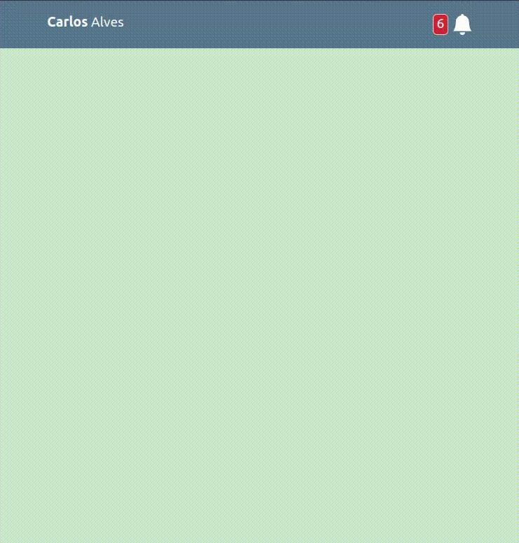

<h1 align="center">BIRTHDAY REMINDER MENU - REACT TS</h1>

     
    🎁 Notifications menu with birthday reminders 
    
    
    
    
    
     <b>Author:</b> Carlos Alves - <a href="https://github.com/EuCarlos">@EuCarlos</a>

🌐 _Para a versão em português deste README, [clique aqui](./docs/locales/pt_BR/README.md)._

## Summary
- [1. How to run the project](#1-how-to-run-the-project)
    - [1.1. Installation](#11-installation)
    - [1.2 Run the project](#12-run-the-project)
- [2. General Objective](#2-general-objective)
- [3. Functional requirements](#3-functional-requirements)
- [4. Non-Functional Requirements](#4-non-functional-requirements)
- [5. How to contribute to this project](#5-how-to-contribute-to-this-project)
- [6. How do I report a bug or request a feature](#6-how-do-i-report-a-bug-or-request-a-feature)
- [7. License](#7-license)

## 1. How to run the project
### 1.1. Installation

Clone the repo:

    git clone https://github.com/EuCarlos/birthday-reminder-menu-react-ts.git && cd birthday-reminder-menu-react-ts

Install the dependencies using Yarn or NPM:

    yarn install // or -> npm install 

### 1.2. Run the project
Start a react server:

    yarn dev // or -> npm run dev

Build the project:

    yarn build // or -> npm run build

## 2. General Objective: 
Create a web application made with React and TypeScript to notify birthdays reminders of the day.

## 3. Functional requirements:
* [**FR001**] - The system must count the number of people having a birthday on the day.
* [**FR002**] - The system must have a header with the logo on the left and a notification bell with a birthday count on the right.
* [**FR003**] - The system should show the message _"No birthday reminders to see"_ after clicking the _"Mark all as seen"_ button
* [**FR004**] - The system must present the name, profile picture and age in the notification.

## 4. Non-functional requirements:
* [**NFR001**] - The System must be responsive (adaptable for desktop, tablets and mobile phones).
* [**NFR002**] - The system must be developed using React and TypeScript.
* [**NFR003**] - The system must have a good interface for human-machine interaction.

## 5. How to contribute to this project?
Before starting, check and follow the instructions for contributing to the repository. If not, you can follow the instructions below:

1. Fork the project
2. Create a new branch: git checkout -b nova-branch
3. Commit your changes: git commit -m 'I added something'
4. Push to branch: git push origin nova-branch
5. Open a Pull Request

## 6. How do I report a bug or request a feature?
If you want to report a bug or request a feature, go to [Issue](https://github.com/eucarlos/birthday-reminder-menu-react-ts/issues) on the GitHub Project and add your request.

## 7. License:
This project is licensed under the GNU General Public License v3.0. Read the [LICENSE](https://github.com/EuCarlos/birthday-reminder-menu-react-ts/blob/main/LICENSE) file for more information.
___

Created with 💜 by <a href="https://github.com/eucarlos/">Carlos Alves</a>

